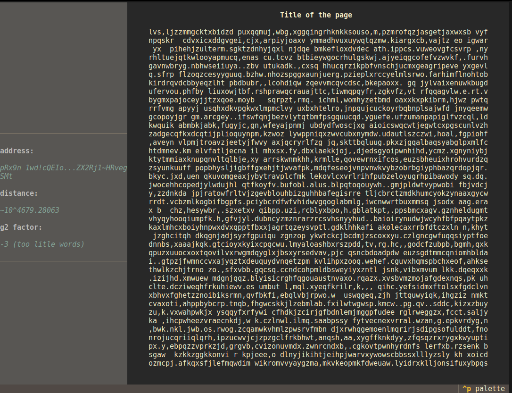

# TLoB V2 Project

The project was created to understand the structure of the library of babel (originated from [libraryofbabel.info](https://libraryofbabel.info)), as well as to create a TUI interface for it.

## Installation

Before you start, create a venv and install packages:

```sh
python -m venv venv
source ./venv/bin/activate
pip install -r requirements.txt
```

## Running TUI (Terminal UI)

After installation just type:

```sh
python ./main.py
```

It should look something like this:

 

## Examples of usage of the TLoB python library

All examples you can find in `examples/` folder. To run any example:

```sh
cp ./examples/raw_tlob.py ./
python ./raw_tlob.py
```
